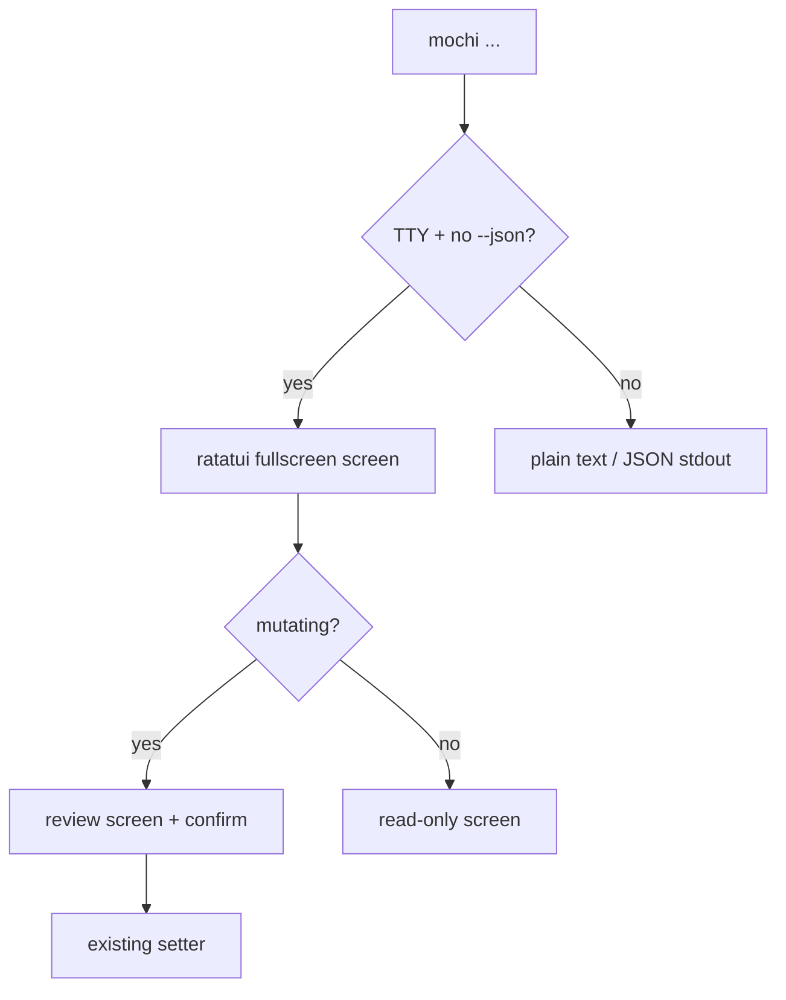
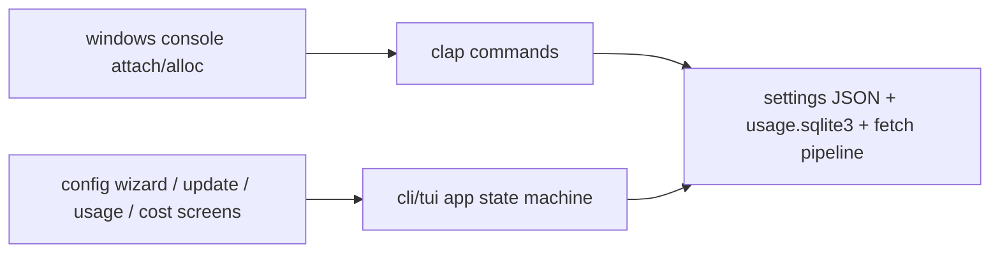

# Spec: Rust-native TUI for the mochi CLI (workit-style)

**Branch:** `feature/cli-tui`

## Context

Mochi's CLI (`src-tauri/src/cli/`, parsed before the Tauri builder) works badly on Windows — release builds set `windows_subsystem`, so there is no console and `println!` output silently vanishes — and four commands are stubs (`status`, `cost`, `config`, `update` exit 2). Workflow-toolkit solved the same class of problem with a workit Ink TUI: thin dispatcher, strict exit contract, TTY guards, review-before-mutate screens. Mochi adopts those patterns rebuilt Rust-native (ratatui + crossterm): fullscreen TUI for interactive surfaces, plain output preserved for scripting, one binary, no extra runtime.

## Goals

- Interactive TUI for four surfaces, phased config-wizard first: config wizard (provider enable/disable, cookie onboarding, review-before-save), update flow (stable-feed check, notes preview, explicit confirm), usage dashboard (same labels as the widget incl. Command Code money line), cost view.
- The 4 stub commands (`status`, `cost`, `config`, `update`) get real implementations underneath; TUI is a presentation layer over the same setters/fetchers the GUI uses — no parallel logic.
- Scripting untouched: non-TTY, piped stdout, or `--json`/`--format` invocations keep today's plain output; exit contract 0 ok / 1 domain failure / 2 usage error.
- Windows console fixed: `AttachConsole(ATTACH_PARENT_PROCESS)` at CLI startup, `AllocConsole` fallback for interactive TUI; verified in Windows Terminal.
- Secrets never rendered: masked input, redacted logs; cookie values never written to disk outside the existing settings/cookie store.

## Non-goals

- Node/Ink sidecar (decided: Rust-native, one binary).
- Driving the React frontend from CLI commands (needs display/WebView; fails where CLI matters).
- Notification backend (separate follow-up).
- Changing the GUI tray/widget/settings behavior.
- Appindicator left-click UX change (platform constraint, owner decision pending).

## Architecture

### Invocation gate

### Module layout

### Phase order

1. Real implementations for `status`, `cost`, `config`, `update` (plain output first).
2. TUI shell: gate, exit contract, terminal restore guards, Windows console.
3. Config wizard screen.
4. Update flow screen.
5. Usage dashboard + cost view screens.

## Data flow / contracts

| Term              | Meaning                                                                                                                                                  |
| ----------------- | -------------------------------------------------------------------------------------------------------------------------------------------------------- |
| TTY gate          | `should_use_tui()`: stdin/stdout both TTY, no `--json`/`--format` flag, stdout not piped; otherwise plain output. Scripts never see the TUI.              |
| Exit contract     | `0` success; `1` domain failure (human message on stderr, no stack trace); `2` usage error or missing `--confirm` where required. Mirrors workit.        |
| Terminal restore  | Raw mode + alternate screen teardown in a scope guard on every exit path including panics; `stdin.isTTY` guard before entering.                          |
| Review-before-save | Every mutating screen ends on a confirm step reusing the exact reviewed values; apply calls the same setter the GUI path uses.                           |
| Cookie onboarding | Order mirrors `resolve_session_cookie`: manual paste (masked) → `MOCHI_COMMANDCODE_COOKIE`-style env → browser import; never logs the value.             |
| Windows console   | `AttachConsole` at CLI startup; `AllocConsole` when entering TUI without a console; plain output path unchanged.                                         |

## Acceptance criteria

- CA-01: `mochi config` on a TTY opens the wizard; completing it writes valid settings loadable by the GUI; abort leaves settings untouched.
- CA-02: `mochi config --json` and piped invocations print plain output, never enter the TUI; exit codes 0/1/2 per contract.
- CA-03: `mochi update` shows stable-feed notes and requires explicit confirm before applying; no confirm → no mutation.
- CA-04: Usage dashboard labels match the widget (`5 hours`, `Weekly`, `Billing period` + money line) for identical data.
- CA-05: Terminal state restored after normal exit, error exit, and panic (automated TestBackend render tests + manual checklist on GNOME, macOS, Windows Terminal).
- CA-06: No cookie/token material in stdout, logs, or TUI snapshots; masked input verified by test.
- CA-07: Full validation green (`pnpm lint`, `format:check`, `test`, `build`, `cargo fmt --check`, `cargo clippy -D warnings`, `cargo test --all-targets`); no new `#[cfg(target_os)]` in `src-tauri/src/core/`.
- CA-08: Manual QA checklist recorded in `docs/qa/` (Windows Terminal, GNOME, macOS sessions).
