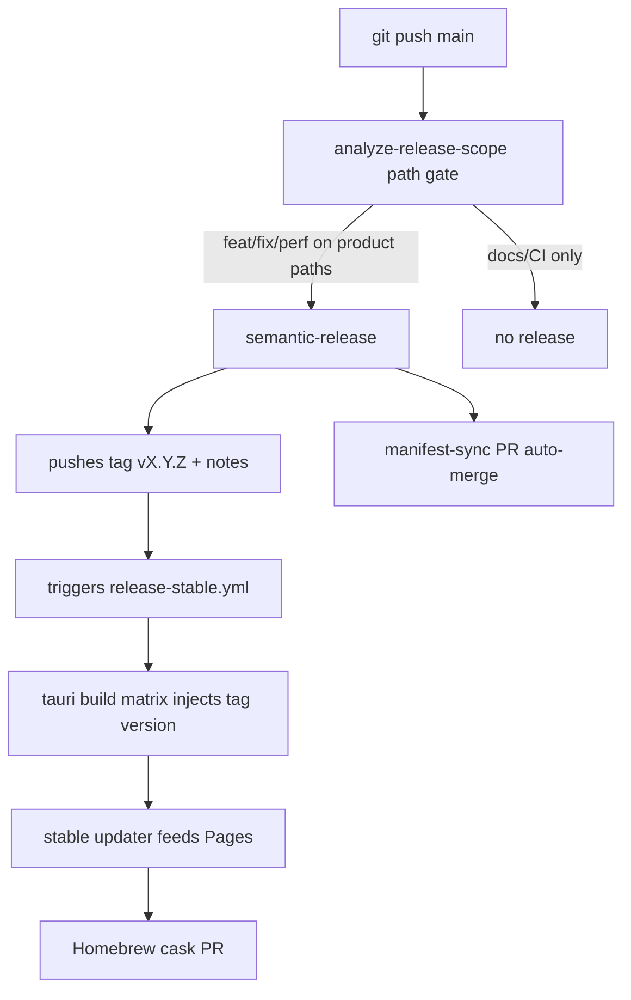
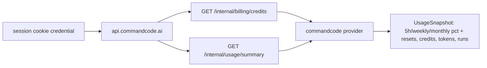

# Spec: Release automation, Command Code provider, Linux hardening, dependency refresh

**Branch:** `feature/release-provider-hardening`

## Context

Mochi's release pipeline (`.github/workflows/release-unstable.yml`, `release-stable.yml`) cuts a timestamped unstable build on every push to `main` and requires manual version bumps across 4 manifests (`package.json`, `src-tauri/Cargo.toml`, `src-tauri/Cargo.lock`, `src-tauri/tauri.conf.json`). Workflow-toolkit solved the same problems with semantic-release: path-gated releases, automatic versioning from conventional commits, and post-release manifest-sync PRs. Mochi adopts that model, kills the unstable channel, and adds a Command Code usage provider, Ubuntu-derived Linux fixes with an enforced core/platform seam, and a full dependency refresh (Zod 4.5 headline).

## Goals

- Push to `main` releases automatically iff conventional-commit product changes touch product paths; version derived from commits, zero manual bumps.
- Unstable channel fully removed: no workflow, no feeds, no cask, no channel switching in app code or install scripts.
- Command Code appears as a first-class usage provider (session-cookie auth, limits + totals snapshot) on all platforms.
- Mochi runs correctly on Ubuntu: tray, windows, updater, CLI verified by running the app; each fix keeps macOS/Windows behavior correct.
- Core/platform boundary documented and enforced: shared core never grows new `#[cfg]` branches; platform behavior lives in platform modules.
- All npm dependencies current and green; Zod ≥ 4.5; every bump verified by the full validation suite or pinned back with a recorded reason.

## Non-goals

- Electron migration (decided: stay Tauri).
- New UI features beyond the Command Code provider tile/rows.
- iOS/mobile targets.
- npm publishing (mochi ships desktop apps, not packages; semantic-release owns versioning/tags/notes only).
- Rewriting platform modules into a trait-layer abstraction (incremental seam enforcement only).

## Architecture

### Release flow

### Command Code provider

### Workstream order

1. Dependency refresh (baseline before new code).
2. Release automation (stable-only semantic-release).
3. Command Code provider.
4. Linux debugging + incremental seam enforcement.

## Data flow / contracts

| Term | Meaning |
| --- | --- |
| Path gate | `analyzeCommitsCmd` script (workit AR-16 pattern): prints `major\|minor\|patch` only when commits since the last `v*` tag touch product paths (`app/`, `src/`, `src-tauri/`, `scripts/install/`, `Casks/`, `packaging/`); empty output skips the release. |
| Manifest sync | Post-release PR (workit AR-15 pattern) setting all 4 manifests to the released version; opened with `RELEASE_SYNC_TOKEN` PAT so CI runs; auto-merge squash. |
| Tag-driven build | `release-stable.yml` reads version from the pushed `v*` tag and injects it into manifests at build time; the build never trusts manifest versions. |
| Product paths | `app/`, `src/`, `src-tauri/`, `scripts/install/`, `Casks/`, `packaging/` — paths whose changes justify a release. |
| windowLimits | Command Code `GET /internal/billing/credits` field: 5-hour / weekly / monthly usage windows with used % and reset timestamps. |
| Session credential | Cookie `__Secure-commandcode_prod_.session_token` captured through mochi's existing browser-session flow (claude/cursor pattern). |

### Command Code endpoints (resolved from HAR capture + site constants bundle)

| Endpoint | Returns | Use |
| --- | --- | --- |
| `GET https://api.commandcode.ai/internal/billing/credits` | `credits.monthlyCredits`, `windowLimits` (fiveHour/weekly/monthly: pct + resetsAt) | Limit bars + credits remaining |
| `GET https://api.commandcode.ai/internal/usage/summary` | `totalTokensIn/Out`, `totalCount`, `totalCost`, `successRate`, `periodBasis` | Totals row |

Auth: `Cookie: __Secure-commandcode_prod_.session_token=...`, `credentials: include`. 401/expiry maps to mochi's standard credential re-auth prompt.

## Acceptance criteria

- CA-01 A push to `main` containing only `docs/` changes produces no tag, no release, no manifest-sync PR.
- CA-02 A push to `main` with a `feat:` commit touching `src-tauri/` produces a `vX.Y.Z` tag, a GitHub Release with generated notes, a 4-platform stable build, `stable.json` updater feeds, and a Homebrew cask PR.
- CA-03 After any release, all 4 manifests equal the released version on `main` via an auto-merged sync PR.
- CA-04 No workflow, script, feed, cask, app setting, or install-script flag references the unstable channel (`grep -ri unstable` over those paths returns only historical docs).
- CA-05 `release.yml` supports `workflow_dispatch` dry-run that runs the gate + version computation without tagging.
- CA-06 Command Code provider registered in the provider registry; selecting it with a valid session cookie renders a snapshot with 5h/weekly/monthly %, reset times, credits remaining, token totals, run count.
- CA-07 Provider responses are validated with Zod 4 schemas; malformed payloads degrade to a typed error state, never a panic; fixtures from the captured HAR drive unit tests.
- CA-08 Mochi launches on Ubuntu; tray icon, tray menu, main window, widget, updater check, and CLI version output each verified with evidence recorded in the QA doc.
- CA-09 Each Linux fix lands in a platform module (`linux_webkit.rs`, `linux_window_controls.rs`, `window_policy.rs`, …) or a new `linux_*` module; no new `#[cfg(target_os)]` branches added to files under `src-tauri/src/core/`.
- CA-10 `pnpm lint`, `pnpm format:check`, `pnpm test`, `pnpm build`, `cargo fmt --check`, `cargo clippy -D warnings`, `cargo test` all pass after the dependency refresh and stay green through the remaining workstreams.
- CA-11 `zod` version ≥ 4.5.0 in `package.json`/lockfile; existing schemas migrated to any changed 4.5 APIs where beneficial; `docs/tech-stack.md` lists final versions for every dependency.
- CA-12 TypeScript, vitest, and other Tier-2/3 majors either upgraded with green suite or pinned with a one-line reason in `docs/tech-stack.md`.

## Decisions

- D-01 Stay on Tauri; Electron rejected (user decision).
- D-02 Full semantic-release adoption; workit's config adapted: no npm publish plugins, path gate via `@semantic-release/exec`, GitHub release + tag only.
- D-03 Unstable channel dies; stable-only releases (`kill unstable i want only stable` — user decision). Manual `workflow_dispatch` on the stable workflow remains for re-runs.
- D-04 Builds are tag-driven; manifest versions become bookkeeping synced post-release (AR-15 pattern), eliminating the 4-file manual bump and its failure mode (v0.2.6 drift history).
- D-05 Command Code auth uses the browser session cookie via existing web-credential flow, not the CLI and not API keys (user decision; HAR evidence).
- D-06 Linux work is discover-by-running on this Ubuntu machine; user supplied no fixed list.
- D-07 Core/platform rework is incremental: fix bugs first, enforce the seam while touching code (user decision).
- D-08 Dependency refresh lands first so provider + Linux work builds on the new baseline; Zod 4.5 is the headline bump; TS 7 attempted with pinned fallback.
- D-09 Release notes: user-facing highlights maintained in `release.yml` `releaseBody` + `release-notes` job (existing convention), now generated from conventional commits with a curated highlights section.

## Future work

- Nightly/prerelease channel if demand returns (infrastructure removed; can be re-added from git history).
- Trait-layer platform abstraction if the seam erodes under future features.
- Per-account Command Code org switching (endpoint supports `orgId`; ship single-account first).
