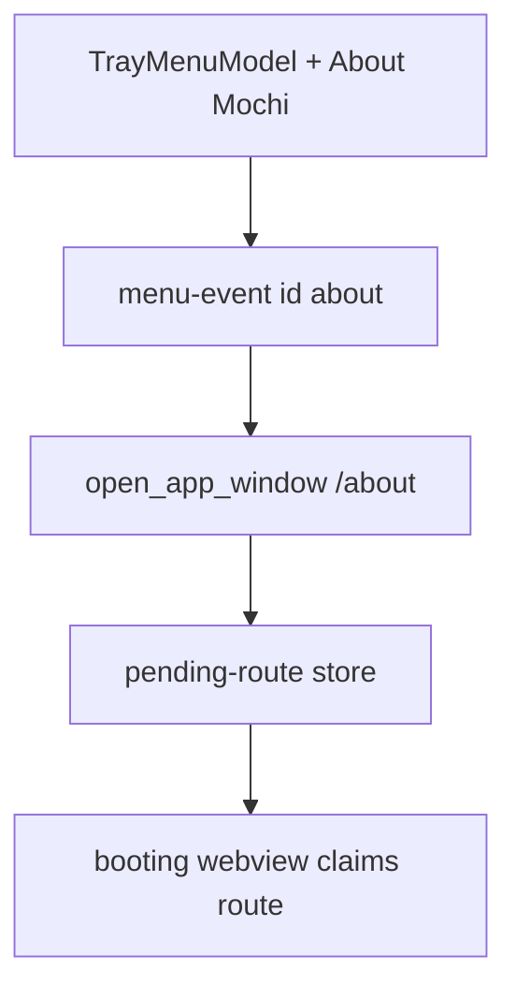
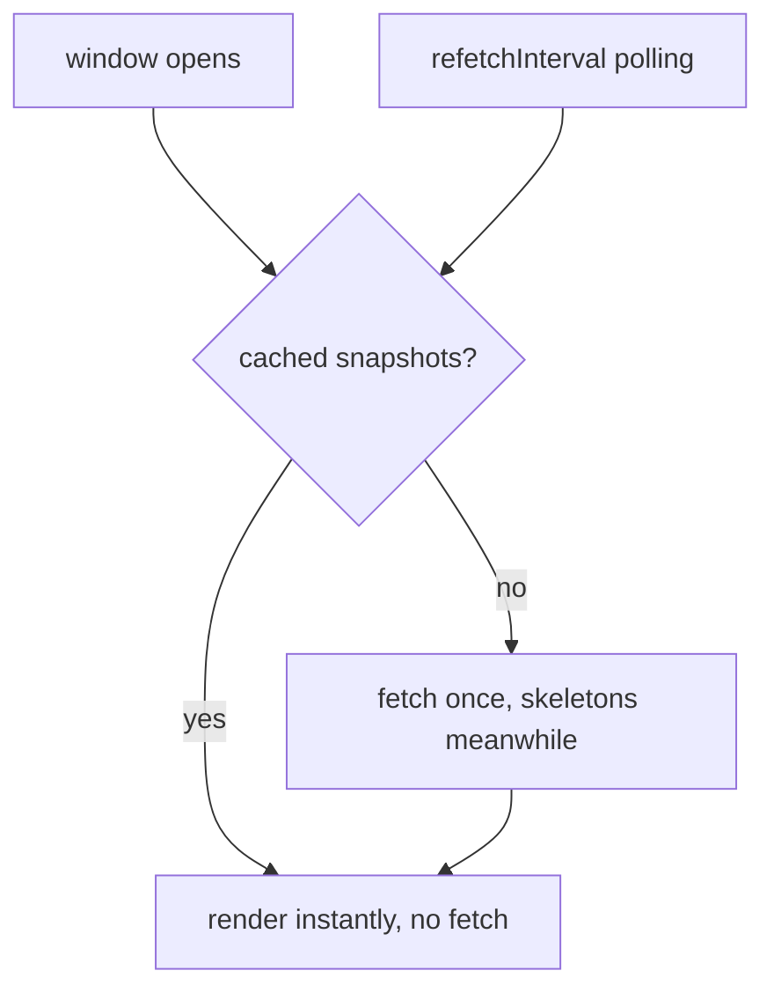
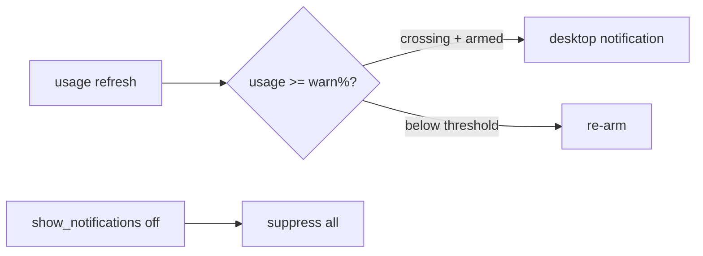

# Spec: Window & menu UX polish (warm open, skeletons, sizes, notifications)

**Branch:** `feature/window-ux-polish`

## Context

Mochi's desktop windows open with a visible staged paint — empty frame, then partial content, then the rest — and the widget shows its action bar before provider rows land, causing layout shift on every open. Usage-snapshot queries refetch on each window open even when the Query cache already holds fresh data, although the configured `refetchInterval` polling already keeps that data live. The native Linux tray menu (`TrayMenuModel` in `src-tauri/src/tray/mod.rs`) has no About entry even though the tray panel footer does. The About and Update windows are oversized for their content, and the Update window renders full release notes inline. Nothing in the codebase ever sends a desktop notification — the `show_notifications` setting exists but is dead — so update-ready, refresh-failure, and usage-threshold events are silent.

## Goals

- Native Linux menu gains an `About Mochi` entry that opens `/about` through the existing pending-route handoff; label matches the panel footer.
- Warm opens are instant: opening widget/panel serves the Query cache with zero network call when cached data exists; a fetch happens only on empty cache. Background `refetchInterval` polling is unchanged.
- First-load skeletons in widget + tray panel: N skeleton rows where N = configured provider count (known synchronously), shimmer, reduced-motion aware; background refetches never flash skeletons over existing data.
- Content-sized windows: compact About dialog; compact Update dialog (title, version, Update button, progress bar only while updating) with release notes behind an inline expander that scrolls internally without resizing the window.
- Real desktop notifications via the Tauri notification plugin for three triggers: stable update ready, scheduled refresh failure, usage at/above threshold (per-provider warn % with global fallback, default 80%; one shot per crossing, re-arm below threshold). The dead `show_notifications` setting becomes the live master toggle; permission denial degrades gracefully.

## Non-goals

- Notification action buttons, sounds, or persistence center (plain notify, v1).
- Threshold hysteresis bands beyond simple below-threshold re-arm.
- Skeletons in Settings, About, or Update windows.
- Changing poll intervals, fetch pipeline, or provider snapshot shapes.
- macOS/Windows menu or window-size parity work beyond what the shared code paths get for free.

## Architecture

### Menu event flow

### Warm-open data flow

### Threshold + notify flow

## Data flow / contracts

| Term              | Meaning                                                                                                                              |
| ----------------- | ------------------------------------------------------------------------------------------------------------------------------------ |
| Warm-open rule    | Window open with non-empty snapshot cache renders from cache and issues no fetch; empty cache fetches once. Polling schedule intact. |
| Skeleton rule     | Skeletons render only on empty-cache first load; row count equals configured provider count; never shown over existing data.         |
| Threshold cross   | Per-provider warn % if set, else global fallback (default 80, range 1–100); notify once per upward crossing; re-arm below threshold. |
| Master toggle     | `show_notifications: false` suppresses all three triggers; no permission prompt is issued while off.                                 |
| Permission denial | Denied/blocked notification permission degrades silently (log line only); triggers keep evaluating so granting later just works.     |
| Compact windows   | About opens at content-sized dialog dims; Update fits title + version + button (+ progress while updating); notes expand inline.     |

## Acceptance criteria

- CA-01: Native Linux menu shows `About Mochi` after "Check for updates"; activating it opens the About window on first click (fresh-window proof, reuses pending-route handoff).
- CA-02: Reopening widget/panel with cached data renders provider rows instantly with zero usage fetch (no fetch in diagnostics log); empty-cache open fetches once.
- CA-03: Empty-cache first load shows exactly N skeleton rows (N = configured providers); rows swap to real data with no layout shift; background refetch never shows skeletons.
- CA-04: About window opens at compact dialog size; Update window fits without scrolling (notes collapsed); expanding notes scrolls internally, window size unchanged; progress bar appears only while updating.
- CA-05: Stable-update-ready, refresh-failure, and threshold-crossing each produce exactly one desktop notification; threshold re-arms after dropping below; `show_notifications: false` silences all.
- CA-06: Threshold settings (per-provider % + global fallback, 1–100 validated) persist and drive the evaluator; default global is 80.
- CA-07: Full validation green (`pnpm lint`, `format:check`, `test`, `build`, `cargo fmt --check`, `cargo clippy -D warnings`, `cargo test --all-targets`); notification capability registered; no new `#[cfg(target_os)]` in `src-tauri/src/core/`.
- CA-08: Manual QA checklist recorded in `docs/qa/` (GNOME cold/warm opens, About/Update sizes, notification appears for each trigger).
